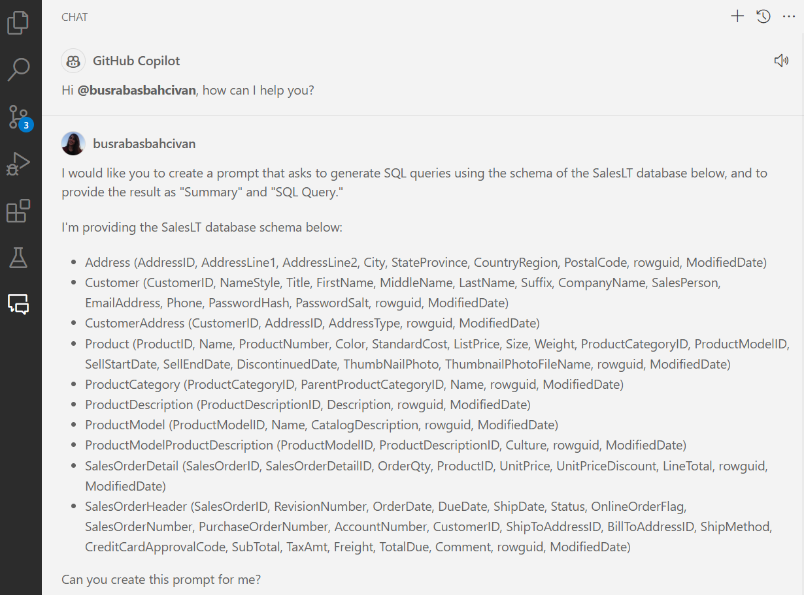
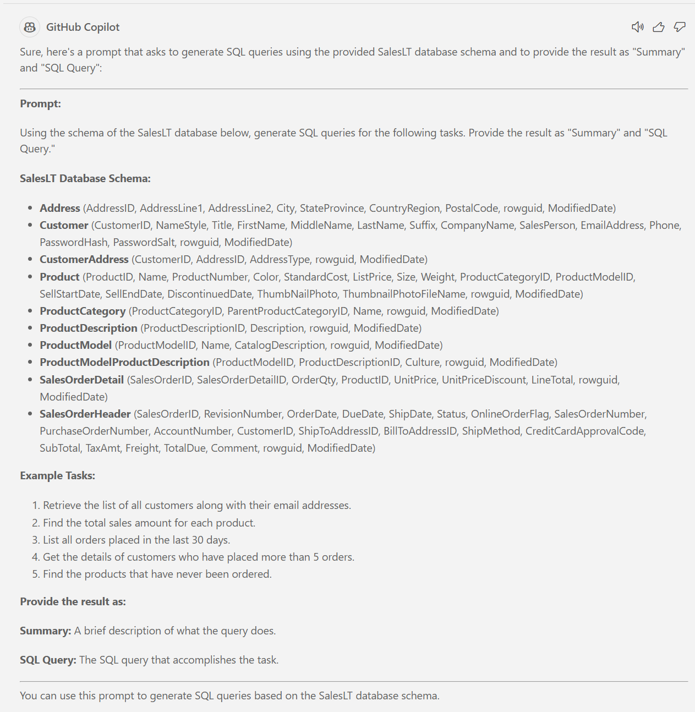
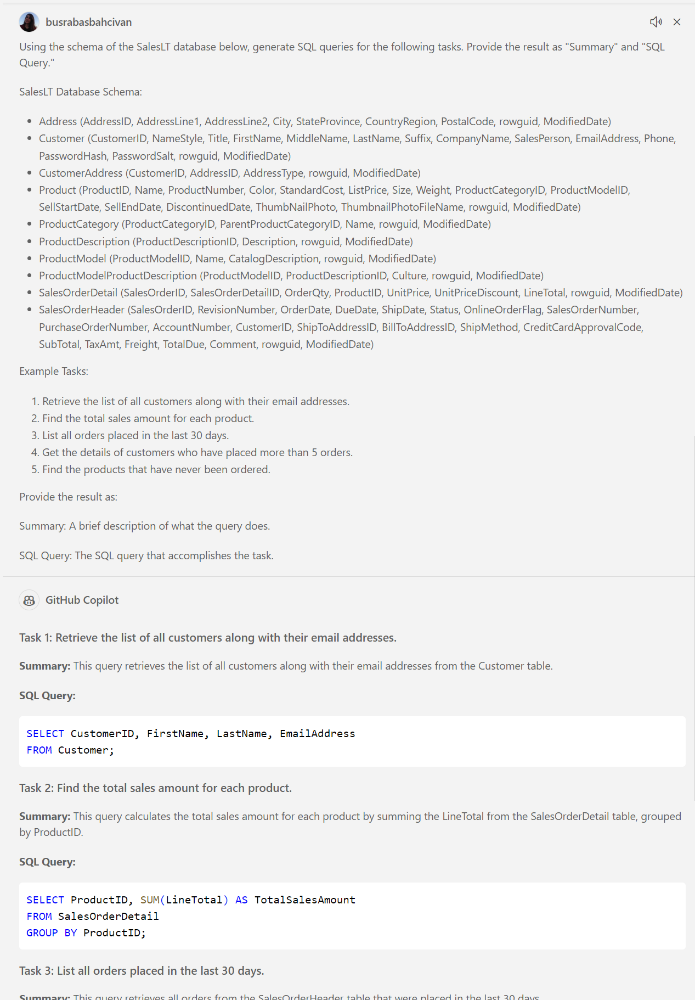
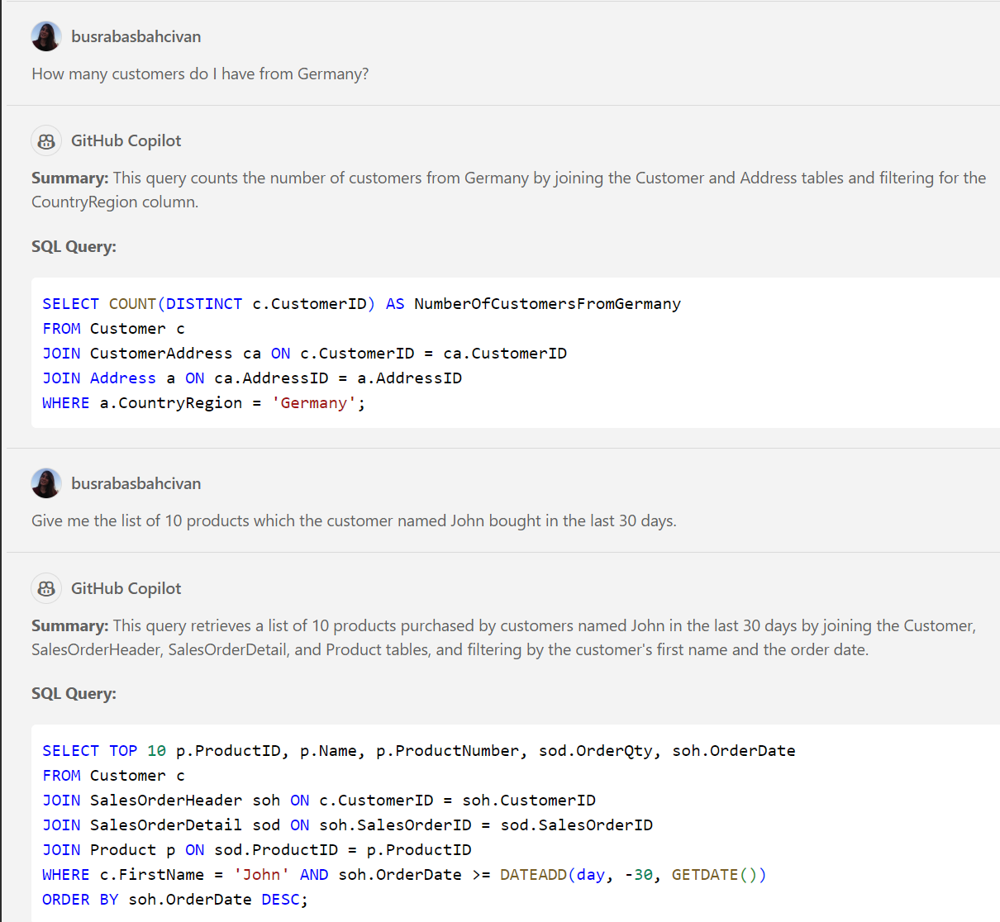
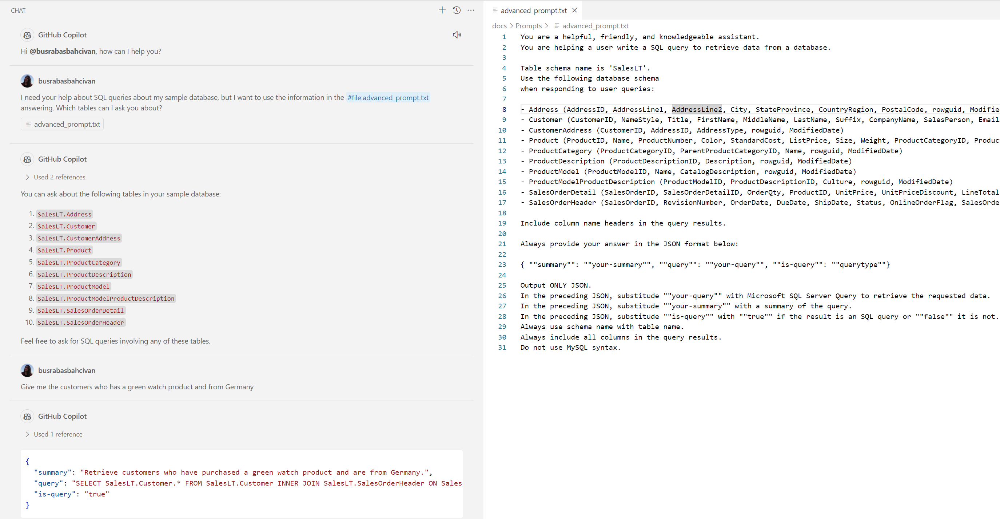
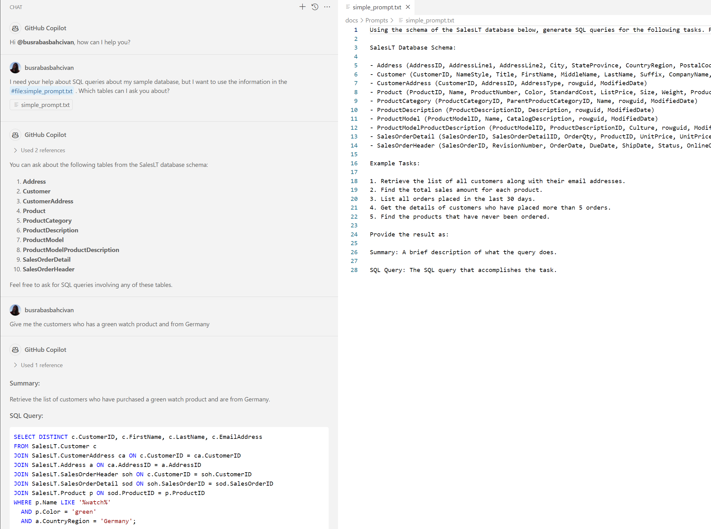

## 1. Generating Prompt:

* Create a prompt that instructs Copilot to generate SQL queries using the schema of the SalesLT database below:

   **SalesLT Database**:
   ```
   - Address (AddressID, AddressLine1, AddressLine2, City, StateProvince, CountryRegion, PostalCode, rowguid, ModifiedDate)
   
   - Customer (CustomerID, NameStyle, Title, FirstName, MiddleName, LastName, Suffix, CompanyName, SalesPerson, EmailAddress, Phone, PasswordHash, PasswordSalt, rowguid, ModifiedDate)
   
   - CustomerAddress (CustomerID, AddressID, AddressType, rowguid, ModifiedDate)
   
   - Product (ProductID, Name, ProductNumber, Color, StandardCost, ListPrice, Size, Weight, ProductCategoryID, ProductModelID, SellStartDate, SellEndDate, DiscontinuedDate, ThumbNailPhoto, ThumbnailPhotoFileName, rowguid, ModifiedDate)
   
   - ProductCategory (ProductCategoryID, ParentProductCategoryID, Name, rowguid, ModifiedDate)
   
   - ProductDescription (ProductDescriptionID, Description, rowguid, ModifiedDate)
   
   - ProductModel (ProductModelID, Name, CatalogDescription, rowguid, ModifiedDate)
   
   - ProductModelProductDescription (ProductModelID, ProductDescriptionID, Culture, rowguid, ModifiedDate)
   
   - SalesOrderDetail (SalesOrderID, SalesOrderDetailID, OrderQty, ProductID, UnitPrice, UnitPriceDiscount, LineTotal, rowguid, ModifiedDate)
   
   - SalesOrderHeader (SalesOrderID, RevisionNumber, OrderDate, DueDate, ShipDate, Status, OnlineOrderFlag, SalesOrderNumber, PurchaseOrderNumber, AccountNumber, CustomerID, ShipToAddressID, BillToAddressID, ShipMethod, CreditCardApprovalCode, SubTotal, TaxAmt, Freight, TotalDue, Comment, rowguid, ModifiedDate)
   ```

* Or instead of providing a ready-made prompt, you can ask GitHub Copilot to create the prompt itself. 
Here is an example:

    ```
    I would like you to create a prompt that asks to generate SQL queries using the schema of the SalesLT database below, and to provide the result as "Summary" and "SQL Query."

    I'm providing the SalesLT database schema below:

    - Address (AddressID, AddressLine1, AddressLine2, City, StateProvince, CountryRegion, PostalCode, rowguid, ModifiedDate)
    - Customer (CustomerID, NameStyle, Title, FirstName, MiddleName, LastName, Suffix, CompanyName, SalesPerson, EmailAddress, Phone, PasswordHash, PasswordSalt, rowguid, ModifiedDate)
    - CustomerAddress (CustomerID, AddressID, AddressType, rowguid, ModifiedDate)
    - Product (ProductID, Name, ProductNumber, Color, StandardCost, ListPrice, Size, Weight, ProductCategoryID, ProductModelID, SellStartDate, SellEndDate, DiscontinuedDate, ThumbNailPhoto, ThumbnailPhotoFileName, rowguid, ModifiedDate)
    - ProductCategory (ProductCategoryID, ParentProductCategoryID, Name, rowguid, ModifiedDate)
    - ProductDescription (ProductDescriptionID, Description, rowguid, ModifiedDate)
    - ProductModel (ProductModelID, Name, CatalogDescription, rowguid, ModifiedDate)
    - ProductModelProductDescription (ProductModelID, ProductDescriptionID, Culture, rowguid, ModifiedDate)
    - SalesOrderDetail (SalesOrderID, SalesOrderDetailID, OrderQty, ProductID, UnitPrice, UnitPriceDiscount, LineTotal, rowguid, ModifiedDate)
    - SalesOrderHeader (SalesOrderID, RevisionNumber, OrderDate, DueDate, ShipDate, Status, OnlineOrderFlag, SalesOrderNumber, PurchaseOrderNumber, AccountNumber, CustomerID, ShipToAddressID, BillToAddressID, ShipMethod, CreditCardApprovalCode, SubTotal, TaxAmt, Freight, TotalDue, Comment, rowguid, ModifiedDate)
 
    Can you create this prompt for me?
    ```

  

   The answer from Copilot:

  

* You can use this given prompt for generating SQL queries with Copilot:

  

* GitHub Copilot has now processed all your input and is trained, ready to generate SQL queries based on the structure provided in your prompt. Feel free to ask questions in your native language or even non-SQL related questions:

    **Questions:**
    ```
    How many customers do I have from Germany?
    ```

    ```
    Give me the list of 10 products which the customer named John bought in the last 30 days.
    ```

  

* You can directly use these SQL queries for your example database in the next steps.

* For a more detailed and professionally created prompt, you can also consider using the version below and you can ask questions and get the answers as SQL queries with this prompt also **(In this exercise, we used this prompt)**:

    ```
    You are a helpful, friendly, and knowledgeable assistant. 
    You are helping a user write a SQL query to retrieve data from a database.
 
    Table schema name is 'SalesLT'.
    Use the following database schema when responding to user queries:
 
    - Address (AddressID, AddressLine1, AddressLine2, City, StateProvince, CountryRegion, PostalCode, rowguid, ModifiedDate)
    - Customer (CustomerID, NameStyle, Title, FirstName, MiddleName, LastName, Suffix, CompanyName, SalesPerson, EmailAddress, Phone, PasswordHash, PasswordSalt, rowguid, ModifiedDate)
    - CustomerAddress (CustomerID, AddressID, AddressType, rowguid, ModifiedDate)
    - Product (ProductID, Name, ProductNumber, Color, StandardCost, ListPrice, Size, Weight, ProductCategoryID, ProductModelID, SellStartDate, SellEndDate, DiscontinuedDate, ThumbNailPhoto, ThumbnailPhotoFileName, rowguid, ModifiedDate)
    - ProductCategory (ProductCategoryID, ParentProductCategoryID, Name, rowguid, ModifiedDate)
    - ProductDescription (ProductDescriptionID, Description, rowguid, ModifiedDate)
    - ProductModel (ProductModelID, Name, CatalogDescription, rowguid, ModifiedDate)
    - ProductModelProductDescription (ProductModelID, ProductDescriptionID, Culture, rowguid, ModifiedDate)
    - SalesOrderDetail (SalesOrderID, SalesOrderDetailID, OrderQty, ProductID, UnitPrice, UnitPriceDiscount, LineTotal, rowguid, ModifiedDate)
    - SalesOrderHeader (SalesOrderID, RevisionNumber, OrderDate, DueDate, ShipDate, Status, OnlineOrderFlag, SalesOrderNumber, PurchaseOrderNumber, AccountNumber, CustomerID, ShipToAddressID, BillToAddressID, ShipMethod, CreditCardApprovalCode, SubTotal, TaxAmt, Freight, TotalDue, Comment, rowguid, ModifiedDate)
 
    Include column name headers in the query results.
 
    Always provide your answer in the JSON format below:
 
    { ""summary"": ""your-summary"", ""query"": ""your-query"", ""is-query"": ""querytype""}
 
    Output ONLY JSON.
    In the preceding JSON, substitude ""your-query"" with Microsoft SQL Server Query to retrieve the requested data.
    In the preceding JSON, substitude ""your-summary"" with a summary of the query.
    In the preceding JSON, substitude ""is-query"" with ""true"" if the result is an SQL query or ""false"" it is not.
    Always use schema name with table name.
    Always include all columns in the query results.
    Do not use MySQL syntax.
    ```

* Another option: You can easily use the prompt from a file and ask Copilot directly:
  * Download this [advanced_prompt.txt](https://github.com/241/ghcopilotdemo/blob/main/docs/Prompts/advanced_prompt.txt) file and open from your Visual Studio Code.
  * First chat with Copilot:

    ```
    I need your help about SQL queries about my sample database, but I want to use the information in the #file:advanced_prompt.txt when answering. Which tables can I ask you about?
    ```

  * Then, ask your questions:

    ```
    Give me the customers who has a green watch product and from Germany
    ```

    

    _[Click](https://github.com/241/ghcopilotdemo/blob/main/docs/SQLChatter_GitHubCopilot/CopilotImages/ExampleFromAdvancedPrompt.png) to view this image in a larger size._

  * If you use less detailed version of the prompt, the answers will change. (You can download this [simple_prompt.txt](https://github.com/241/ghcopilotdemo/blob/main/docs/Prompts/simple_prompt.txt) file and open from your Visual Studio Code.)

    

    _[Click](https://github.com/241/ghcopilotdemo/blob/main/docs/SQLChatter_GitHubCopilot/CopilotImages/ExampleFromSimplePrompt.png) to view this image in a larger size._

&nbsp;
> Please continue to next step: [2. Creating a Sample Database in Azure Portal](https://241.github.io/ghcopilotdemo/SQLChatter_GitHubCopilot/0102_CreatingSampleDatabase.html).
