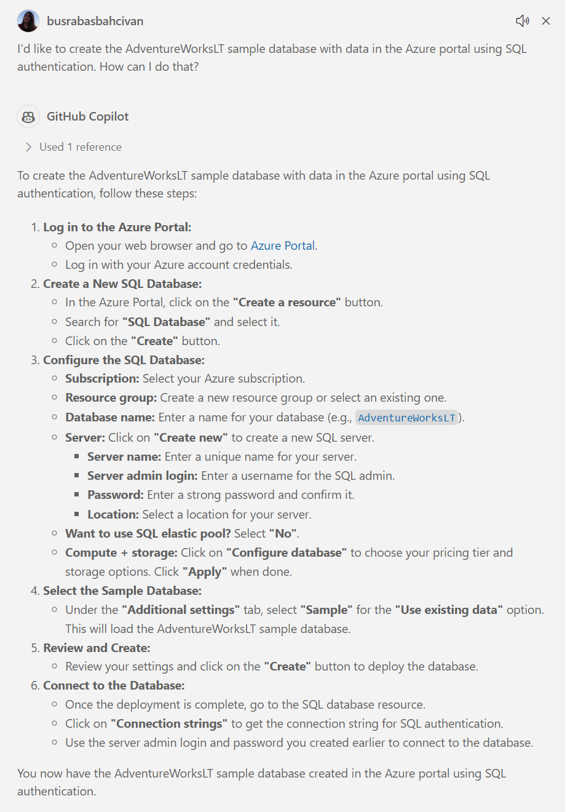
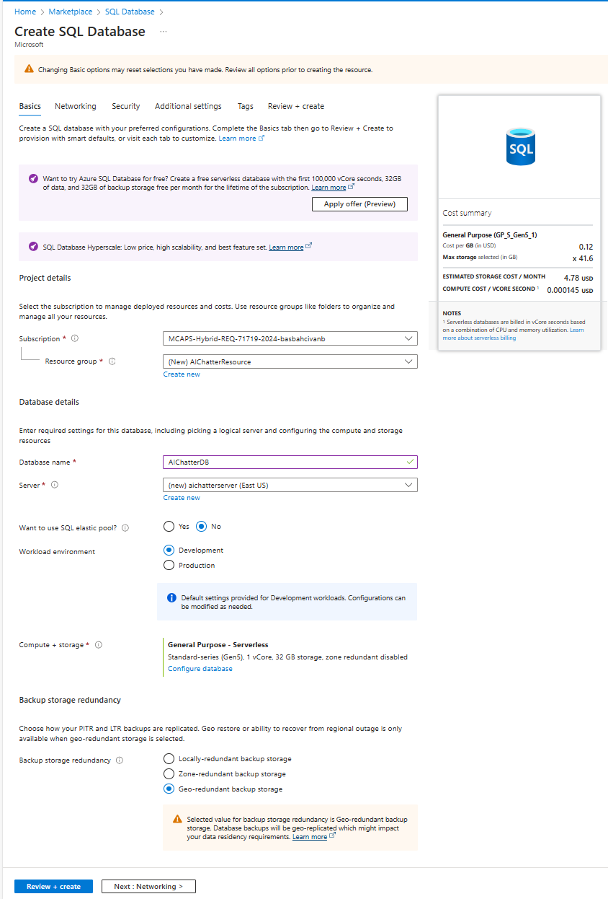
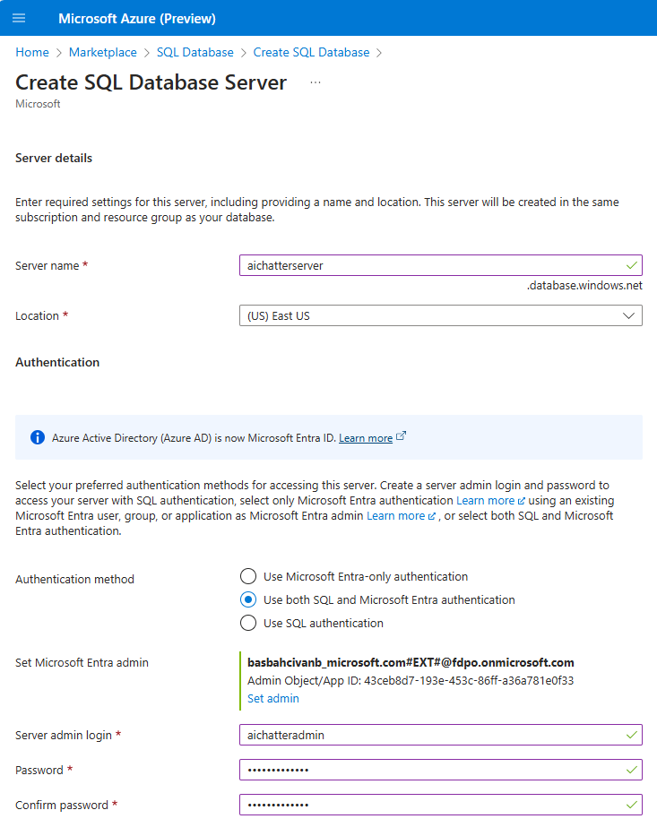
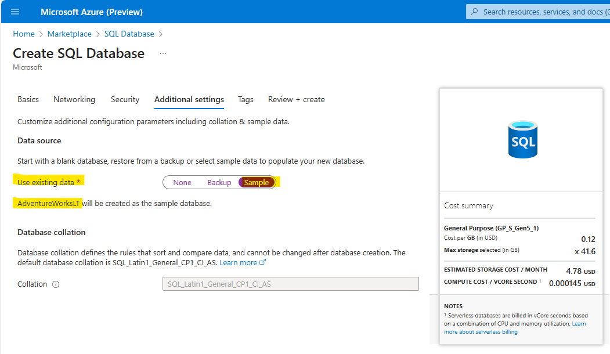
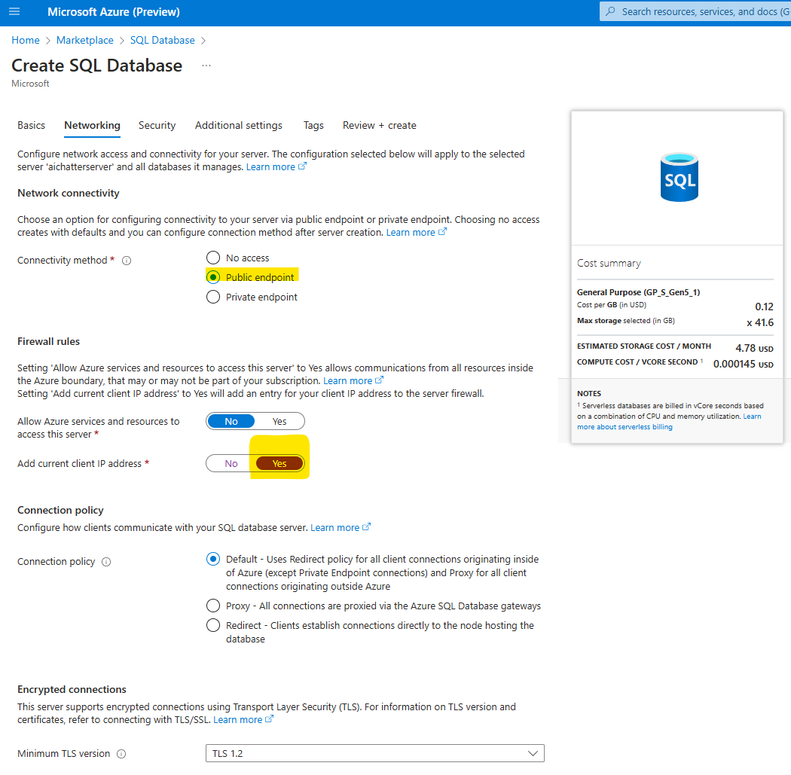
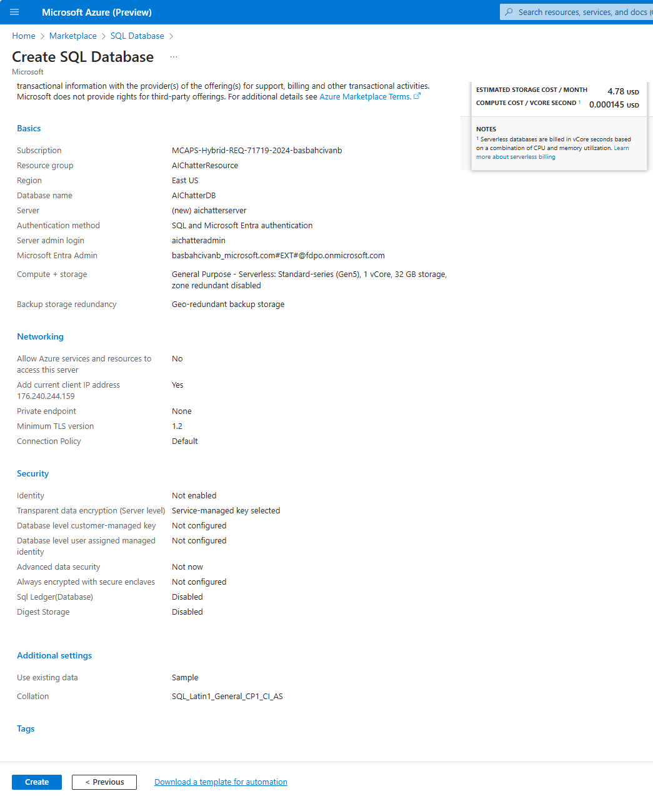

## 2. Creating a Sample Database in Azure Portal:

* The Azure Portal offers an option to use the **AdventureWorksLT** sample database with data. (AdventureWorksLT sample database includes all the tables we provide in the prompt, so we can directly use this). 

   If you’re unsure how to create this database, you can simply ask Copilot and follow the steps it provides:

    ```
    I'd like to create the AdventureWorksLT sample database with data in the Azure portal using SQL authentication. How can I do that?
    ```
    
    

* Create a SQL Database which GitHub Copilot explained above in detail or follow these steps:
  * Open your web browser and go to the [Azure Portal](https://ms.portal.azure.com/). 
  * Sign in with your Azure account credentials.
  * In the left-hand menu, click on **"Create a resource"**.
  * Search for **"SQL Database"** and select it from the list.
  * Click on **"Create"** to start the setup process.
  * Configure Basic Settings
    * **Subscription**: Select your Azure subscription.
    * **Resource Group**: Create a new resource group named **"AIChatterResource"**.
    * **Database Name**: Enter **"AIChatterDB"** for your database name.
    * **Server**: Create a new server named **"aichatterserver"**. Select **"East US"** or any other location for Location step. For authentication, please select **"Use both SQL and Microsoft Entra authentication"** and provide server admin login and password. (Please note this admin user and password for the source code configuration later.)
  Select yourself as **"Microsoft Entra admin"** from the list then click **"OK"**:

    Creating SQL DB - Basic Settings:

    

    Creating SQL Server:

    

   * **Sample Data**: Under the "Additional settings" tab, select **"Use existing data"** and choose **"AdventureWorksLT"** as the sample data:

     

   * **Networking**: 

     * Ensure to add your current client IP address to the server firewall rules to allow access.
     * You can do this by clicking on **"Public endpoint"** as "Connectivity method" and adding your current client IP address:

     

   * **Review and Create**: 
       * Review all the settings and click on **"Create"** to deploy the SQL database:

     

 * Now, you have a database with sample data that has the same schema structure as the SalesLT database you provided in the prompt.
 
 &nbsp;
> Please continue to next step: [3. Coding the SQLChatter Project with Copilot](https://241.github.io/ghcopilotdemo/SQLChatter_GitHubCopilot/0103_CodingSQLChatterProject.html).