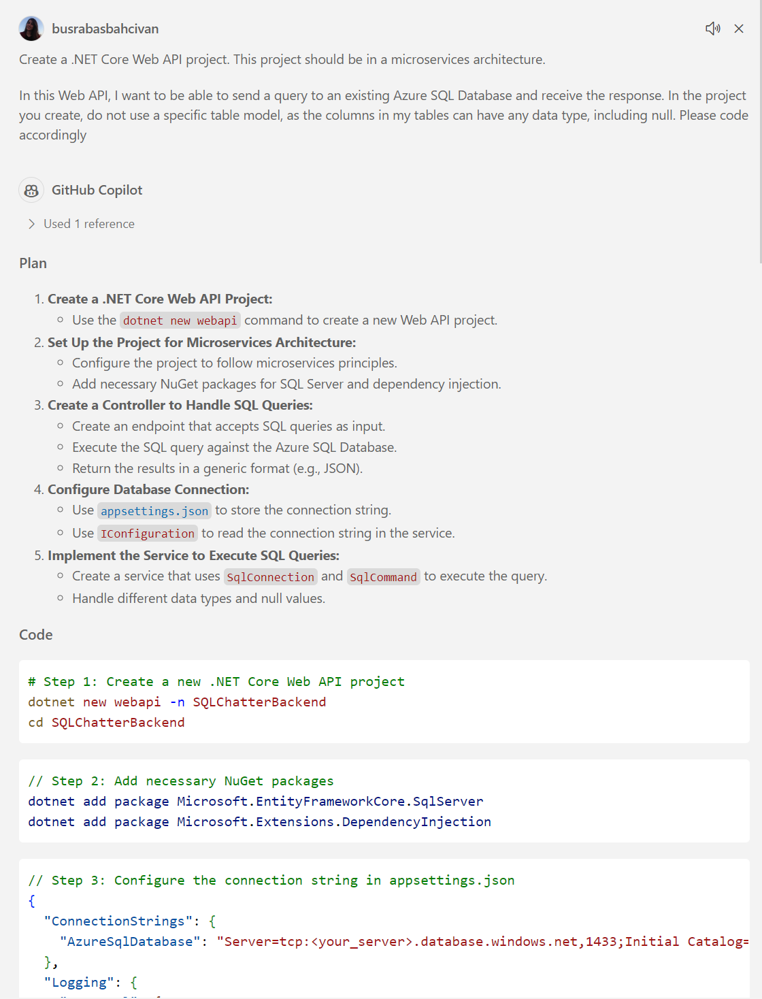
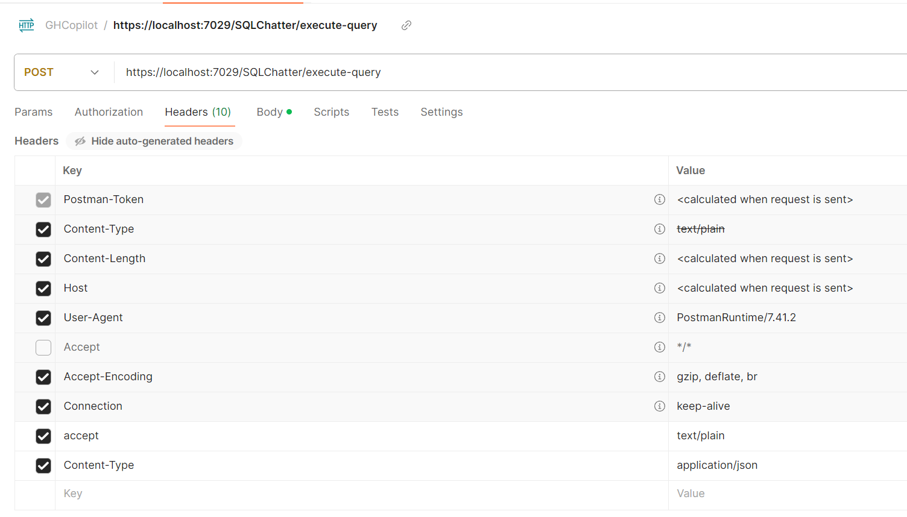
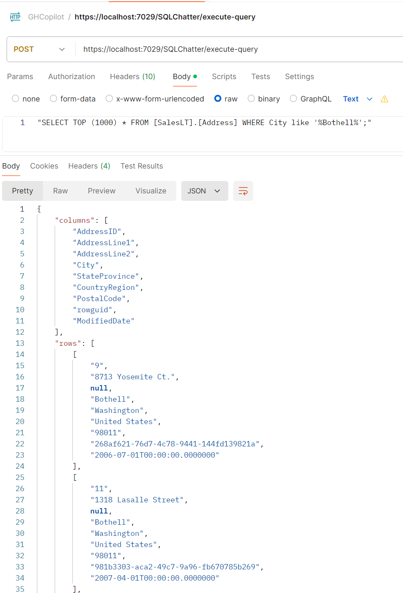

## 3.1. Coding .NET Core Web API Project (Backend):

* Prepare a prompt by using the requirements in the before section (Step 3), and ask to GitHub Copilot. For example:

    ```
    Create a .NET Core Web API project. This project should be in a microservices architecture.

    In this Web API, I want to be able to send a query to an existing Azure SQL Database and receive the response. In the project you create, do not use a specific table model, as the columns in my tables can have any data type, including null. Please code accordingly.
    ```

* GitHub Copilot will prepare a project with the source code. Try to follow all the steps and try to create and code the .NET Core Web API project.

   _**Note:** Please remember that GitHub Copilot may provide different answers to each question you ask, so don't expect the same response every time. And please note that you can use GitHub Copilot for every problem you encounter while coding. You can even send runtime errors directly to GitHub Copilot and get a solution._

   

* If you want to use a pre-built .NET Core Web API backend project:

  * Open your terminal and clone the repository using the following command:

    ```git clone https://github.com/241/ghcopilotdemo.git```

  * Navigate to the project directory: ```cd ghcopilotdemo```

  * You can open the source code with Visual Studio Code by this command: 
  
    ```code GHCopilotSQLChatter_WebApi```

  * In the **"ghcopilotdemo\GHCopilotSQLChatter_WebApi\GHCopilotSQLChatter_WebApi\appsettings.json"** file, find the "AzureSqlDatabase" object:

      

      _[Click](https://github.com/241/ghcopilotdemo/blob/main/docs/SQLChatter_GitHubCopilot/CopilotImages/ConnectionString.png) to view this image in a larger size._
  
  * Update above code in **"appsettings.json"** file with the following detailed information from Azure Portal:

     * In the Azure Portal, go to the SQL Databases and find your created database named **"AIChatterDB "**.
     
     * Under the "Connection strings" menu in the left, copy "ADO.NET (SQL authentication)" connection string and replace the "AzureSqlDatabase" value in **"appsettings.json"** file. Please update the masked password with your admin password which you created before in "Step 2. Creating a Sample Database in Azure Portal".

  * Open "Terminal" in Visual Studio Code window. 
  
  * You should install the required Nuget packages into your solution:

     ```dotnet restore```

  * You can run your Web API project and validate the service by testing its endpoints directly within the Swagger UI, which will automatically generate the API documentation and allow for real-time interaction with your API. For this, follow these steps:
     
      * Build your project: 
      
        ```dotnet build```
      
      * Navigate to the directory where the "GHCopilotSQLChatter_WebApi.csproj" file is located to run the project:

        ```cd GHCopilotSQLChatter_WebApi```

      * Then run the project from "https" address:

        ```dotnet run --launch-profile https```

      * When the project is running, you will see a message in the terminal indicating the URL where the application is operating. This will typically be a URL like https://localhost:7029. (In this excercise our port is 7029).

      * Open your browser and visit the following URL: ```https://localhost:7029/swagger```.
      (If your application is running on a different port, replace 7029 with the corresponding port number.)

      * In the end you will see the Swagger UI to test your endpoint.
      
      * You can try it out with this sample query: ```"SELECT TOP 5 * FROM [SalesLT].[Customer]"```

        

  * If you prefer to call your Web API using Postman, your endpoint url will be like ```https://localhost:7029/SQLChatter/execute-query``` and you should use "POST" method: 

      The header parameters are:

       

      The body and the result:

       

  * Now, your Web API is ready to run the SQL Queries which comes from frontend. For this, please do not stop the running Web Api project.

&nbsp;
> Please continue to next step: [3.2. Coding Blazor Web App Project (Frontend)](https://241.github.io/ghcopilotdemo/SQLChatter_GitHubCopilot/010302_CodingFrontend.html).