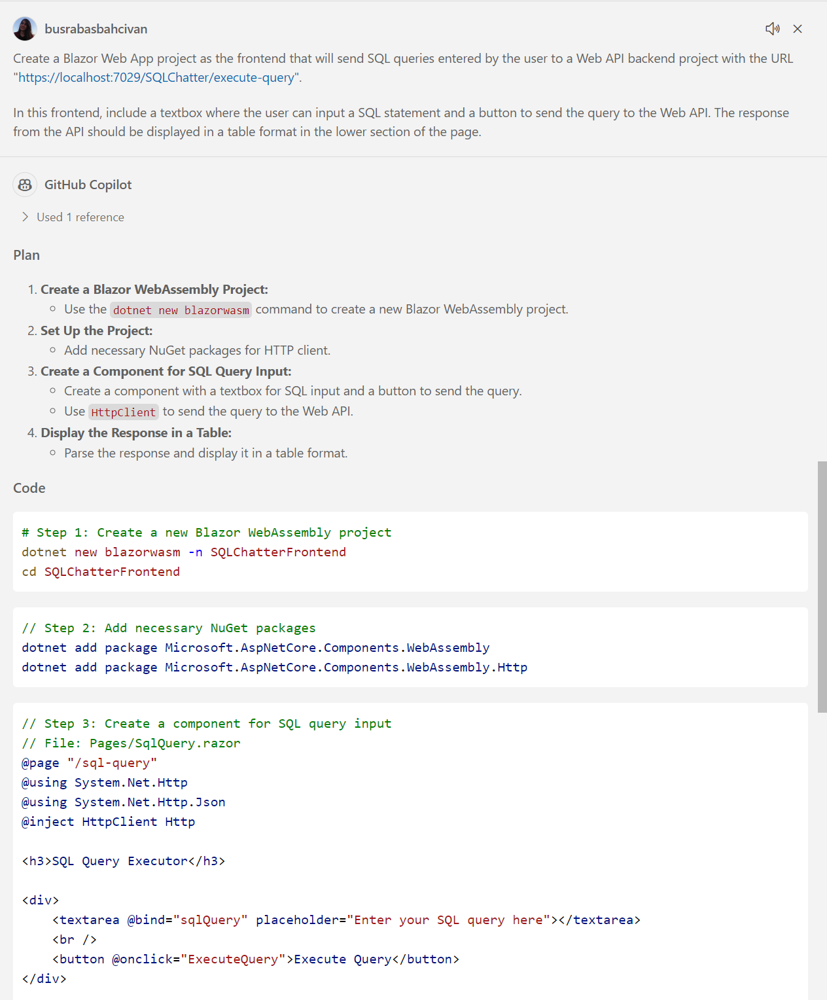
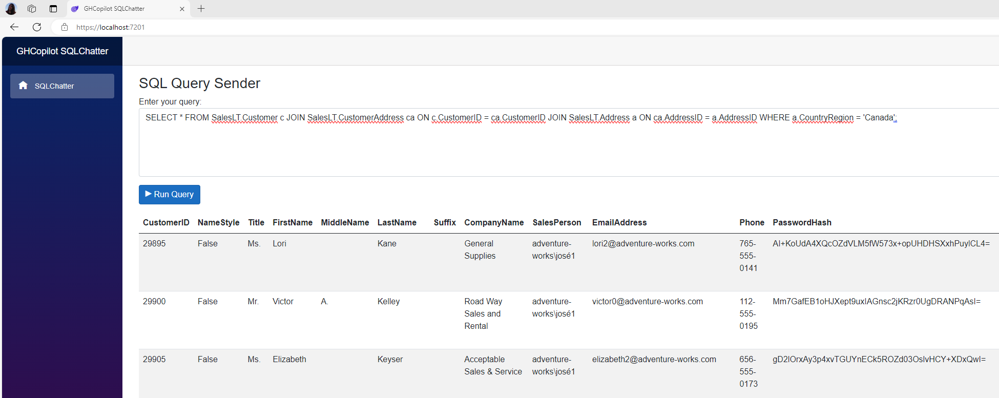

## 3.2. Coding Blazor Web App Project (Frontend):

* Prepare a prompt by using the requirements in the before section (Step 3), and ask to GitHub Copilot. For example:

    ```
   Create a Blazor Web App project as the frontend that will send SQL queries entered by the user to a Web API backend project with the URL "https://localhost:7029/SQLChatter/execute-query". 
   
   In this frontend, include a textbox where the user can input a SQL statement and a button to send the query to the Web API. The response from the API should be displayed in a table format in the lower section of the page.
    ```

* GitHub Copilot will prepare a project with the source code. Try to follow all the steps and try to create and code the Blazor Web App project.

   _**Note:** Please remember that GitHub Copilot may provide different answers to each question you ask, so don't expect the same response every time. And please note that you can use GitHub Copilot for every problem you encounter while coding. You can even send runtime errors directly to GitHub Copilot and get a solution._
   
   

* If you want to use a pre-built Blazor Web App frontend project:

  * Open your terminal and clone the repository using the following command (If you already cloned the repo in "Step 3.1. Coding .NET Core Web API Project", skip this):

    ```git clone https://github.com/241/ghcopilotdemo.git```

  * Navigate to the project directory: ```cd ghcopilotdemo```

  * You can open the source code with Visual Studio Code by this command: 
  
    ```code GHCopilotSQLChatter_WebApp```

   * Navigate to the **ghcopilotdemo\GHCopilotSQLChatter_WebApp\GHCopilotSQLChatter_WebApp\Pages\Index.razor** file and change the Web API address "https://localhost:7029/SQLChatter/execute-query" with yours in **Index.razor** file.

   * Open "Terminal" in Visual Studio Code window. 
  
   * You should install the required Nuget packages into your solution:

     ```dotnet restore```

   * Build your project: 
   
     ```dotnet build```
      
   * Navigate to the directory where the "GHCopilotSQLChatter_WebApi.csproj" file is located to run the project:

     ```cd GHCopilotSQLChatter_WebApp```

   * Then run the project from "https" address:

     ```dotnet run --launch-profile https```

   * When the project is running, you will see a message in the terminal indicating the URL where the application is operating. This will typically be a URL like https://localhost:7201. (In this excercise our port is 7201).

   * Open your browser and visit the following URL: ```https://localhost:7201```.
      (If your application is running on a different port, replace 7201 with the corresponding port number.)

   * In the end your Web App is ready to send the SQL Queries to the Web API.
      
   * You can try it out with this sample query: 
   
      ```SELECT * FROM SalesLT.Customer c JOIN SalesLT.CustomerAddress ca ON c.CustomerID = ca.CustomerID JOIN SalesLT.Address a ON ca.AddressID = a.AddressID WHERE a.CountryRegion = 'Canada';```

      &nbsp;
      

   * You can generate SQL queries using Copilot, then copy and paste them directly into the Blazor Web App. Once the query is submitted, execute it to retrieve and display the results returned from the Web API.

   &nbsp;
> Please continue to: [Conclusion](https://241.github.io/ghcopilotdemo/SQLChatter_GitHubCopilot/0104_Conclusion.html).