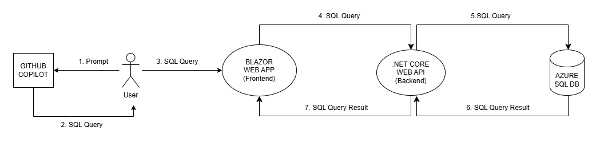

## 3. Coding the SQLChatter Project with Copilot:

We have a sample Azure SQL Database created in Step 2. We want to send queries to this DB using SQL statements and retrieve the responses. To do this, let’s code two separate projects: Backend and Frontend.

First, we need a query statement prepared to send to the DB. For this, we trained GitHub Copilot using a prompt as described in Step 1. In this example, mentioned before, we used [advanced_prompt.txt](https://github.com/241/ghcopilotdemo/blob/main/docs/Prompts/advanced_prompt.txt). 

We will ask the trained Copilot questions about tables in our native language and expect it to generate SQL statements in response. We will take this SQL statement and ask it through the Blazor Web App.

The Blazor Web App project will be our frontend project and will send the SQL query entered by the user to the Web API backend project. In this frontend project, we will ask the user to write the SQL statement into a textbox and use a button to send this query to the Web API. The result of the query will be displayed in a table format in the lower section.

The backend project will be a .NET Core Web API project, and we will design it as a microservices-based project. This API will send the SQL query received from the Blazor Web App directly to the Azure SQL Database and retrieve the response. The backend project should be able to run the query and get the response for all our tables without using any specific table models.

To summarize, the project diagram will be like this:

 &nbsp;
> Please continue to next step: [3.1. Coding .NET Core Web API Project (Backend)](https://241.github.io/ghcopilotdemo/SQLChatter_GitHubCopilot/010301_CodingBackend.html).