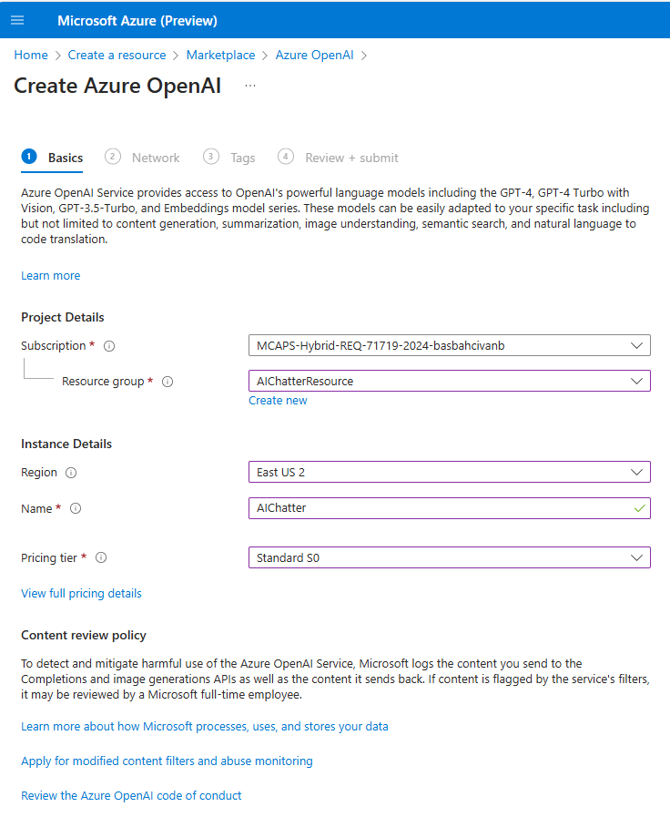
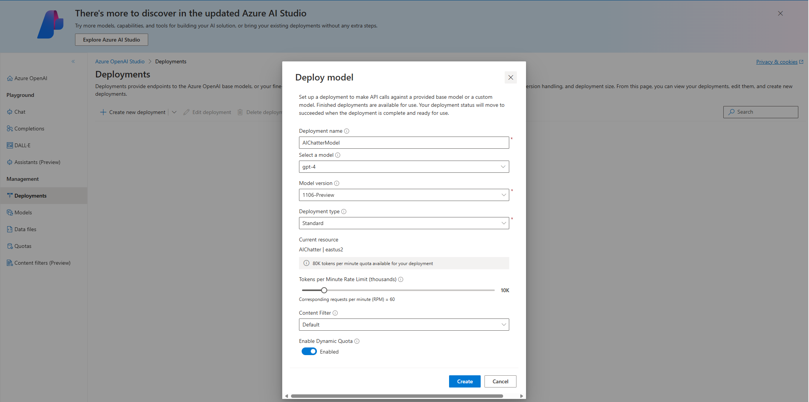
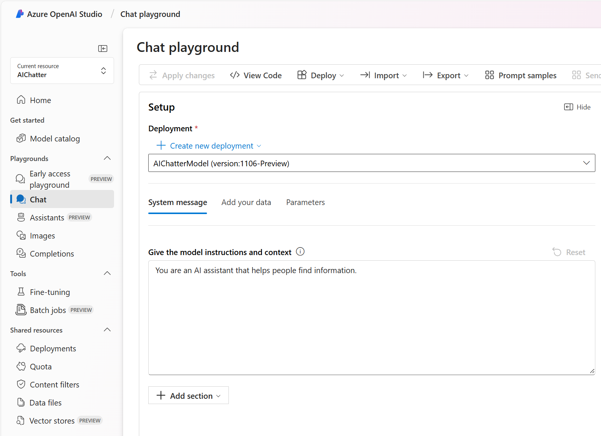

## 2. Configuration in Azure Portal:

This app is currently hooked up to an Azure SQL database and an Azure open AI service, but all of the concepts at could apply to any relational database like MySQL or PostgreSQL and any variation of the open AI service as long as it's using the GPT-4 model.

Here are the steps to set up the Azure SQL database:

### 2.1. Create Azure SQL Database:

* Open your web browser and go to the [Azure Portal](https://ms.portal.azure.com/). 
* Sign in with your Azure account credentials.
* In the left-hand menu, click on **"Create a resource"**.
* Search for **"SQL Database"** and select it from the list.
* Click on **"Create"** to start the setup process.
* Configure Basic Settings
  * **Subscription**: Select your Azure subscription.
  * **Resource Group**: Create a new resource group named **"AIChatterResource"**.
  * **Database Name**: Enter **"AIChatterDB"** for your database name.
  * **Server**: Create a new server named **"aichatterserver"**. Select **"East US"** or any other location for Location step. For authentication, please select **"Use both SQL and Microsoft Entra authentication"** and provide server admin login and password. (Please note this admin user and password for the source code configuration later.)
  Select yourself as **"Microsoft Entra admin"** from the list then click **"OK"**:

   Creating SQL DB - Basic Settings:

  

   Creating SQL Server:

  

* **Sample Data**: Under the "Additional settings" tab, select **"Use existing data"** and choose **"AdventureWorksLT"** as the sample data:

  

* **Networking**: 

  * Ensure to add your current client IP address to the server firewall rules to allow access.
  * You can do this by clicking on **"Public endpoint"** as "Connectivity method" and adding your current client IP address:

  

* **Review and Create**: 
  * Review all the settings and click on **"Create"** to deploy the SQL database:

 

### 2.2. Create OpenAI Service:

* In the Azure Portal, click on **"Create a resource"**.
* Search for **"Azure OpenAI"** and select it.
* Click on **"Create"** to start the setup process.
* **Subscription**: Select your Azure subscription.
* **Resource Group**: Choose thr existing resource group **"AIChatterResource"**.
* **Region**: Select **"East US 2"** region supports the GPT-4 model.
* **Name**: Provide **"AIChatter"** name for your OpenAI service.

* Review all the settings and click on **"Create"** to deploy the OpenAI service.

* Deploy GPT-4 Model:
  * Go to the created Azure Open AI service named **"AIChatter"**.
  * Open the "Model deployments" under the "Resource Management" menu.
  * Click on the **"Manage Deployments"** button.
  * Click on the **"Create new deployment"** button.
  * **Deployment name**: Provide **"AIChatterModel"** name for your GPT-4 model.
  * Select **"gpt-4"** as Model.
  * Select **"1106-Preview"** as Model version.
  * Select **"Standart"** type as Deployment type.
  * Select **"Default"** as Content Filter.
  * Then Create the model:

* You will see your deployed GPT-4 Model:

&nbsp;
> Please continue to next step: [3. Configuration in Source Code](https://241.github.io/ghcopilotdemo/SQLChatter_OpenAI/0103_ConfigurationInSourceCode.html).