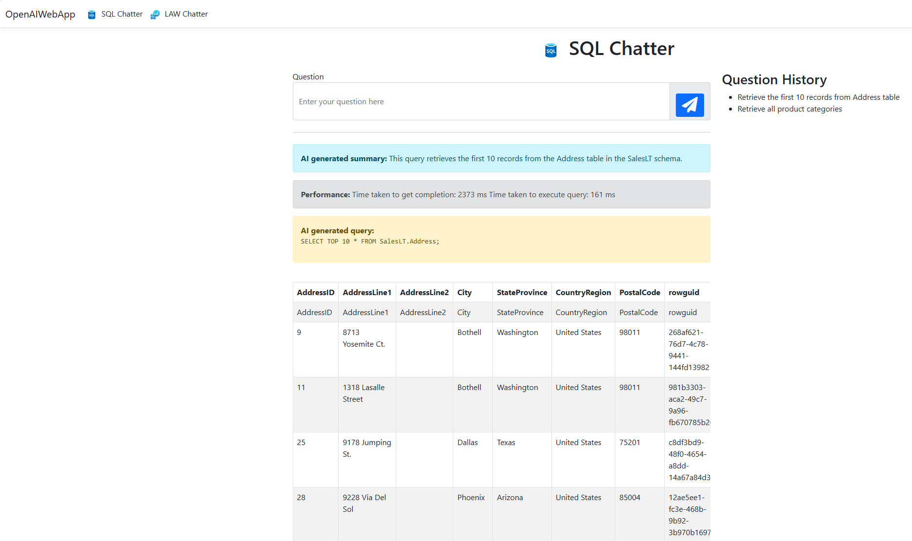

## 4. Running the Application:

* If you use Visual Studio 2022: 

  * You should install the required Nuget packages into your solution from the ide.

  * Then run the application or press F5 button.

  * The browser will open with the available port. Typically, the URL will be: ```https://localhost:7046/```

* If you use Visual Studio Code: 

  * Open "Terminal" in Visual Studio Code window. 

  * You should install the required Nuget packages into your solution:

     ```dotnet restore```

  * Build your project: 
  
     ```dotnet build```
      
  * Then run the project from "https" address:

     ```dotnet run --launch-profile https```

  *  When the project is running, you will see a message in the terminal indicating the URL where the application is operating. This will typically be a URL like https://localhost:7046. (In this excercise our port is 7046).

  *  Open your browser and visit the following URL: ```https://localhost:7046```.
      (If your application is running on a different port, replace 7046 with the corresponding port number.)
   
* You can try the application with your natural language inputs. (e.g., "Retrieve the first 10 records from Address table" or "Retrieve all product categories"):

   

* Continue testing the app to ensure it can successfully query the database using natural language inputs and display the results correctly.

&nbsp;
> Please continue to: [Conclusion](https://241.github.io/ghcopilotdemo/SQLChatter_OpenAI/0105_Conclusion.html).